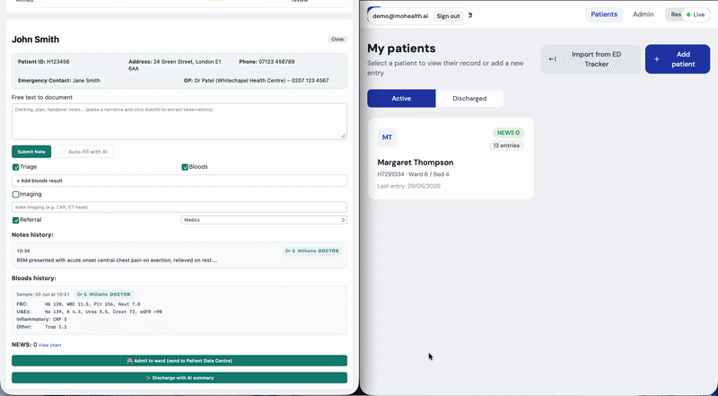
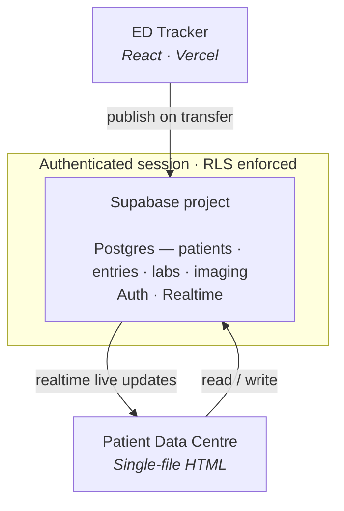

# Patient Data Centre

A single-file **ward clinical record** backed by Supabase, receiving live ED → ward transfers from [ED Tracker](https://github.com/M-Omarjee). The ward-side counterpart to the ED board: where a patient's record lives once they're admitted.

> ⚠️ **Synthetic data only.** This is a portfolio/demo project, not a medical device, and is not for real patient data.

---

## What it is

One self-contained `.html` file — no build step, no framework, no install. Open it in a browser (or host it statically) and it connects to a shared Supabase backend.

## Architecture

## Features

- **Patient list** with active / discharged filtering.
- **Patient record** with tabbed views:
  - **Timeline** — chronological notes, NEWS entries, and transfers, tagged by location (ED / ward) and source.
  - **Results** — cumulative blood-panel tables with high/low flags and per-panel FHIR (`DiagnosticReport` / `Observation`) toggles.
  - **Imaging** — a synthetic, watermarked chest X-ray viewer with zoom/brightness/contrast/annotation controls, a radiology report, and a FHIR `ImagingStudy`.
  - **Journey** — a unified ED → ward timeline with a time-in-ED metric, populated by real transfers from ED Tracker.
- **Structured entry** — ward round, NEWS2 (RCP thresholds, Scale 1/2, live aggregate + risk banner), and note/task entries.
- **Admin** — admit, discharge, re-admit, and delete patients.

## Shared backend & integration

- Uses **one Supabase (Postgres) project**, shared with ED Tracker.
- Receives **admit-to-ward** publishes from ED Tracker (patient + notes + NEWS + bloods + imaging request + transfer event).
- **Realtime** — the patient list and open record update live (no refresh) when ED Tracker admits a patient. A status pill shows the live-connection state.
- **Auth + Row Level Security** — a real Supabase Auth login gates the app; RLS is enabled on all tables, so only an authenticated session can read or write.

## Tech

Vanilla HTML / CSS / JS · Tailwind (CDN) · `@supabase/supabase-js` (CDN) · no build tooling.

## Running it

1. Open the `.html` file directly in a browser, or host it statically (e.g. GitHub Pages).
2. Sign in with a **Supabase Auth** user. Create one in the Supabase dashboard (Authentication → Users → Add user) with **"Auto Confirm User"** ticked.

The Supabase project URL and **publishable** key are set near the top of the file. The publishable key is safe to expose in client code by design; with RLS enabled, access still requires a valid login. The secret key is never used.

## FHIR note

The FHIR resources (`DiagnosticReport`, `Observation`, `ImagingStudy`) are **illustrative** — generated client-side to show how the data would map to interoperability standards. This is not a conformant FHIR server.

## Security & governance notes

- **Synthetic data only.** RLS on a free-tier Supabase project does not meet NHS information-governance requirements (DSPT / DPIA / Caldicott) for real patient data.
- Access control is "any authenticated clinician can access the shared ward record" — the correct model for a shared ward. Role-based policies would be the next step toward production.
- Free Supabase projects pause after ~7 days of inactivity (resume from the dashboard) and have no backups — the app can reseed demo data if the tables are empty.
